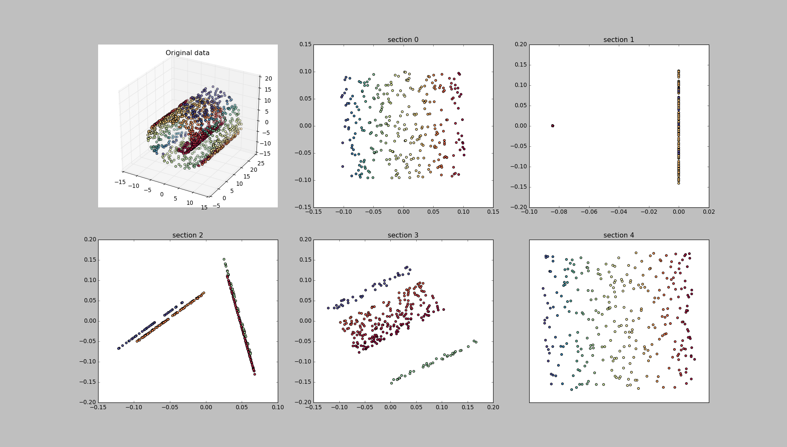
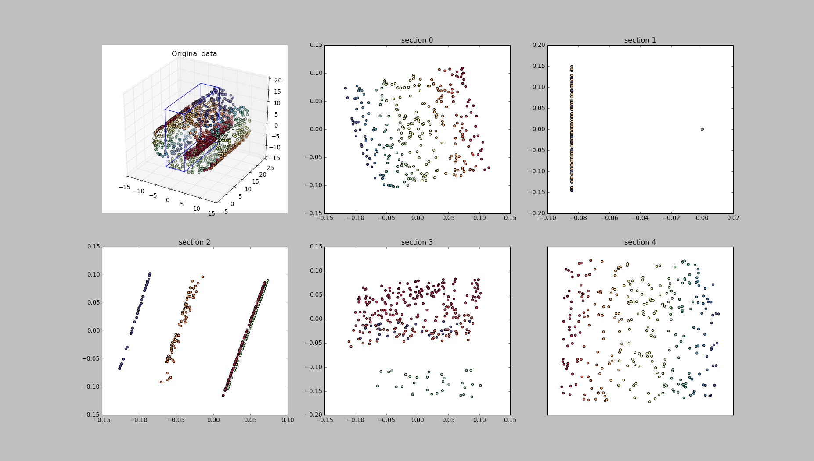
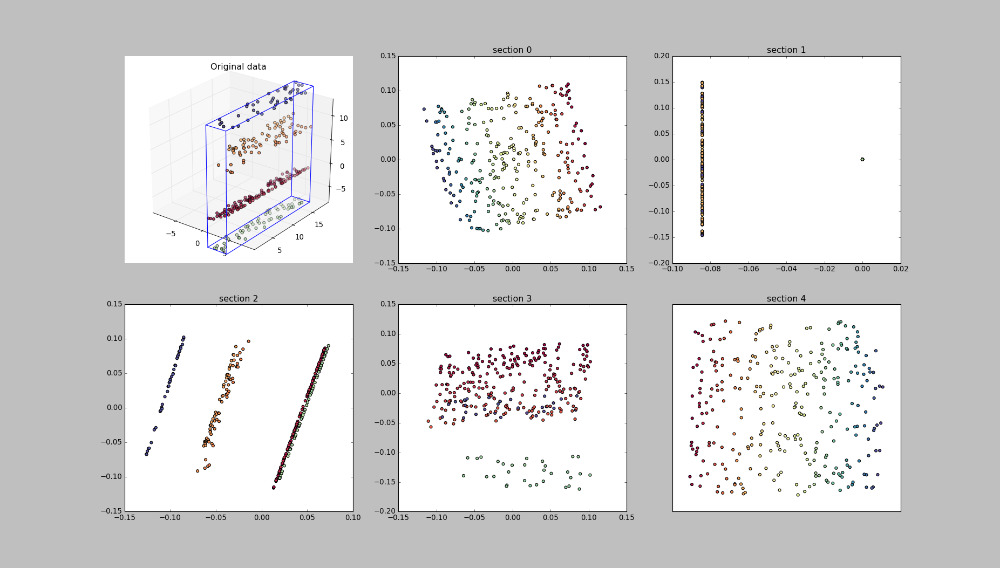
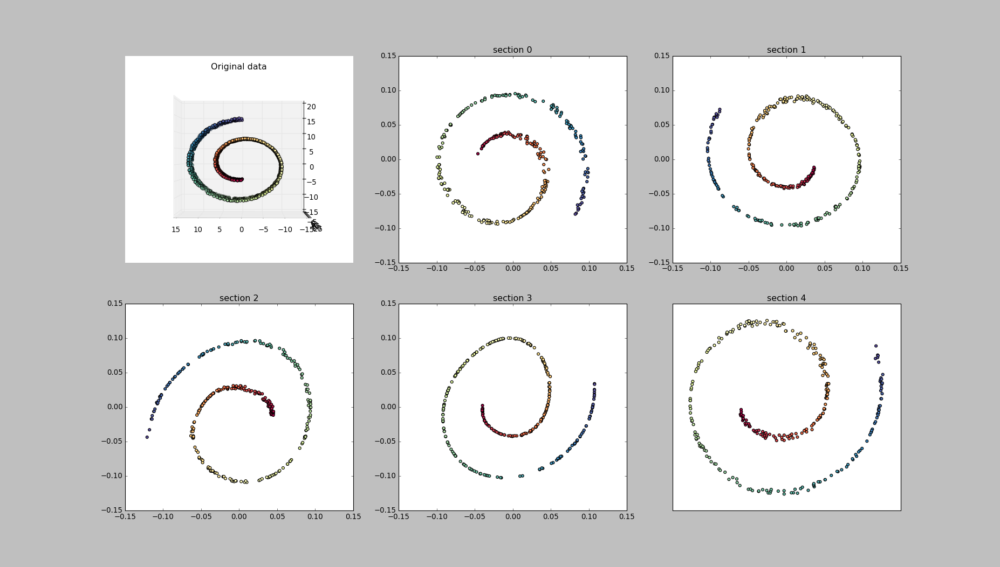

# Using Fovea to Visualize Non-Linear Dimensionality Reduction

## Introduction

The process of non-linear dimensionality reduction involves taking
data of some pre-determined dimensionality (usually of dimension three 
or greater) and applying some transformation to it such that it is projected
onto a topological space of lower dimension. The goal in applying such a 
transformation is to make visualization of the data easier while retaining
its key, structural attributes. There are a number of currently established
algorithms that perform nldr, and each facilitates its own set of strengths
and weaknesses. For this demonstration, we will use the default Locally Linear
Embedding algorithm provided with Scikit-Learn to perform the backend dimensionality
reduction, and subsequently visualize the transformed data using Fovea's suite
of tools.

## The Dataset

For this example, we will perform dimensionality reduction on the Swiss Roll
dataset, aptly named given its resemblance to the Swiss Roll cake. This data
is commonly used in evaluating the performance of nldr algorithms as it exhibits
a high degree of structured non-linearity. Pictured here is the dataset with
a rainbow-like Matplotlib colormap applied.

  

## Performing the Reduction

The first step in creating our visualization involves generating the Swiss Roll data
and applying the Locally Linear Embedding transformation to that data. To do this,
we will import scikit-learn into our project. The modules relevant to the task at hand
are `manifold` and `datasets`:

    from sklearn import manifold, datasets

Next, we will conjure the Swiss Roll data

    X, color = datasets.samples_generator.make_swiss_roll(n_samples=1500)

In the datasets module, `sample_generator` is a class that provides a number of utility
functions for generating interesting sets of data. The class' `make_swiss_roll` function does
exactly as expected: generates a 3D swiss roll dataset. The function returns two items.
The first, `X`, is an n x 3 array of points residing in the dataset, where `n = n_samples`. The second
is a 1 x n array of the relative positions of each row in `X`. It is this sort of relational
data that we need in order to apply a Matplotlib colormap to the roll, so we call it `color`. 

Now that we have our data, we can apply the LLE transformation to it. Since our source data
makes use of three dimensions, we will make our target topological space have dimension two.
The reduction can be performed painlessly by a single call to scikit-learns `manifold.locally_linear_embedding`
like so:

    X_r, err = manifold.locally_linear_embedding(X, n_neighbors=12,
                                                 n_components=2)

The arguments to the LLE function are `X`: the dataset to be reduced, `n_neighbors`: the number
of neighboring points that the algorithm should use in performing its reduction, and `n_components`:
the dimension of the target topological space. The function returns the reduced dataset (`X_r`) and
the error (`err`) induced by the LLE algorithm. For the purposes of our demonstration, we will not
make use of the error variable, but it can be useful in evaluating the success of the LLE algorithm
when applied to your data.

## Setting up Fovea's Matplotlib Axes

Now that we have access to both our source and target datasets, we can begin to set up Fovea for
visualization. Fovea makes use of its own 2D and 3D axes which derive from Matplotlib's own 2D
and 3D axes, respectively. The beauty of this is that you can use all of Matplotlib's standard
syntax and features for constructing the bare bones setup of your visualization and then tap
into Fovea's additional capabilities in order to enhance the interactivity of that sparse construction.
As such, we will import Matplotlib's pyplot module, giving it the alias of `plt` as is common practice.

    `import matplotlib.pyplot as plt`

We also need to import Fovea's 2D and 3D axes classes. These are located in the `retina.core.axes` module
and we import them like so:

    `import retina.core.axes`

Now that the requisite modules have been imported, the first thing that we'll need to do is create a Matplotlib
figure to hold our axes:

    fig = plt.figure(figsize=(20, 20))

For this demonstration we will be sectioning the Swiss Roll into five constituent parts and plotting their 2D
projections individually. Thus we will need one 3D axes to hold the original 3D dataset, and five 2D axes to
display each section's projection for a total of six axes altogether. We can use Matplotlib's `GridSpec` utility
to arrange these axes in a 2 x 3 tabular fashion as follows:

    from matplotlib import gridspec
    gs = gridspec.GridSpec(2, 3) 

Now are figure has effectively been split into a 2 x 3 arrangement of space to which we can attach an Axes instance
at each grid coordinate. We'll put our original 3D data in the top-left corner using the following command:

    nld = plt.subplot(gs[0, 0], projection='Fovea3D')

Note here that we get the first grid space by indexing with `[0,0]` the gs object, and we specify that we want to
override Matplotlib's default axes and use the Fovea3D axes instead by passing our axes type as the `projection`
keyword argument.

## Sectioning our Data Using Fovea's NLDR Utility Functions

Fovea provides a suite of functions and classes for generating, tweaking, and coordinating visualizations of data
transformed by non-linear dimensionality reduction algorithms. For this example, we're going to delve more deeply
into those resources provided in the module `retina.core.mapping`. The function we will use is called `ordered_section`,
and it allows you to partition your data along some axis (either x, y, z, or a higher dimensional one). This is useful
for generating a visualization in which your data is parceled in sections of even size, either from left to right,
bottom to top, or, in the case of the z-axis, back to front. This is exactly what we'll be doing here, as it will
allow us to more adequately understand the behavior of the LLE algorithm based on which axis our data is sectioned
along. To create the ordered sections, we simply need to call the aforementioned function like so

	num_sections = 5
	sections = nldr.mapping.ordered_section(X, num_sections, axis=0)

The `ordered_section` function returns a list of numpy arrays containing the sections of data. In this case, we specify that
we want to section along the x-axis (axis 0), although alternatively we could have used the y or z axes as well (`axis=1`,
`axis=2`, respectively). Since we are segmenting our data into five parts, sections will be a list of length five.

Now, because we have segmented our data, we must do the same for our colors array in order to be able to faithfully apply
the proper Matplotlib color map to each section of data individually. Our color array is one-dimensional, so we will need
to permute the ordering of the color values in the same way as the rows of our data matrix were permuted by the `ordered_section`
function. If you examine the source of `ordered_section`, you can see that the main sorting work of the function is done in the 
following line:

   data[:, axis].argsort()

where `data` is the input data array. The numpy function `argsort` just returns the ordering of indices required to sort the
data array. Thus, in order to achieve the same permutation of our colors list, we can index it like so:

    colors = color[X[:, 0].argsort()]

Finally, we need to segment our color array into five individual segments that will map to each section of our segmented swiss
roll data.

	colors = [color[i*len(color)/num_sections:(i+1)*len(color)/num_sections] for i in range(num_sections)]

Now that we have our original data and color map segmented, we can proceed with the primary legwork of preparing our data for
visualization: applying the LLE algorithm to each section individually, and plotting each section in its own 2D axes.

## Generating 2D Projections and Creating Layers

We will now use a simple, iterative loop to generate the 2D Fovea axes for our visualization. This is where Fovea's functionality
will really begin to shine as it will allow us to group our plots in layers, making for the seamless viewing of individual sections
and their projections later on down the line.

Our loop will need to keep track of four different items. The row of our figure window to which we are seeking to add each section's
individual 2D projection axes, the number of the section with which we are working, the section data arrays themselves, and the individual
color segments. Since we already have our 3D subplot setup at index (0, 0) of the gridspec, we can enumerate the row numbers for each
of the remaining subplot axes as `[0, 0, 1, 1, 1]`. We can get the current section number by using Python's `range(num_sections)` construct,
and therefore the main control statement for our loop will be:

    for i, j, sec, clr in zip([0, 0, 1, 1, 1], range(num_sections), sections, colors):

Now we can dissect the content of the loop line by line.

At each step we use Fovea's `add_layer` function to add a new layer to our 3D data subplot. Remember, we have the subplot axes saved in the
variable `nld`, so we simply write:

    swiss_sec = nld.add_layer('section ' + str(j))

It's important to note here that the `add_layer` function returns a layer object that can be manipulated autonomously by way of a number of
class methods, more details about which can be found in the `retina.core.layer` module.

Now that we have our layer object, we need to add some data to it. The `add_layer` function accepts `x_data` as the first argument, `y_data`
as the second argument, and, in the case of 3D axes, `z_data` as the third argument. We can extract these components from our section of the
swiss roll data and add them to the layer structure like so:

	swiss_sec.add_data(sec[:, 0], sec[:, 1], sec[:, 2])

Finally, we need to build the layer. This is the process in which Fovea plots all the layer's data and internally generates the Matplotlib
artists to be interactively manipulated. The function takes in the string name of the layer to be built, as well as an optional `plot` argument
which specifies the plotting function to be used. If one is not provided, the default `pyplot` plotting function is used. In this case we
are going to want to generate a scatter plot of our data, so we use the `scatter` function that is bundled as part of Matplotlib's 3D axes.
The other kwargs are standard Matplotlib plotting arguments that are passed to the scatter function.

    nld.build_layer(swiss_sec.name, plot=nld.scatter, c=clr, cmap=plt.cm.Spectral)

Now that we have our 3D plot setup, we turn to our 2D subplots and generate a Fovea2D axes to hold each section's projected, two-dimensional data.
We index it within the gridspec as `(i, (j + 1) % 3)` as we would like to mod out the section number (plus 1) by the number of columns in the gridspec
 position array.

    ax = plt.subplot(gs[i, (j + 1) % 3], projection='Fovea2D')

Now, we fall back on scikit-learn to generate the LLE projection of the section. Note here that since we are applying the LLE algorithm individually,
each projection will be taken without the context of the other sections of the roll. Thus we are not, in fact, projecting the manifold in its
entirety, as there is no way to deduce a one-to-one mapping between source points and their projections. This is one of the inherent limitations
of the way in which the LLE algorithm is implemented, but it actually serves our visualization purposes in that we can infer more concretely
the structural makeup of each section and how that structure is translated into a 2D projection without worrying about interference from the noise
of those sections surrounding it. All of this is done with:

    X_r, err = manifold.locally_linear_embedding(sec, n_neighbors=50,
                                                 n_components=2)

In an identical fashion to the procedure for setting up the 3D axes, we add the projected data to a new layer within each 2D axes and build the layer.
We also set the title of each axes using Matplotlib's built-in `set_title` function:

    proj = ax.add_layer('section ' + str(j) + ' proj')
    proj.add_data(X_r[:, 0], X_r[:, 1])
    ax.build_layer(proj.name, plot=ax.scatter, c=clr, cmap=plt.cm.Spectral)
    ax.set_title('section ' + str(j))

Voila! If at this point you run the script, you will get a figure window that should look something like this...

Here we have a static visualization of each section of our data and its 2D projection, the sort of thing you could generate as a typical Matplotlib
application. However, there's no easy way to visualize our sections here, at least not without giving each its own individual axes, and even if we
could visualize these sections, there'd be no reliable way to identify them with their 2D plots. What's more, this visualization isn't interactive
and that really hinders us from attaining the sort of intuition that we'd like to be able to gain from these plots. This is where Fovea comes to
the rescue! With just a few simple key bindings that call on the core functionality of the Fovea axes, we can setup an intuitive, interactive visualization
that will tell us more than we ever wanted to know about dimensionality reduction and the LLE algorithm.

## Introducing Interactivity

To introduce interactivity, we are going to create a simple `EventSystem` class that will take in a Matplotlib figure instance upon instantiation
and bind mouse movement and click events to this figure's canvas. Here is the first part of the class definition.

	class EventSystem:
		def __init__(self, fig):
			self.fig = fig
			self.hover_sec = None
			self.click_sec = None
			self.fig.canvas.mpl_connect('motion_notify_event', self.mouse_over)
			self.fig.canvas.mpl_connect('button_press_event', self.mouse_click)

As you can see, we define variables to hold the figure, the axes of the 2D section over which the mouse is currently hovering, and the axes of the
2D section which was last clicked. Furthermore, we bind two as-of-yet undefined functions to the figure's canvas. These will be called when the
axes are moved over by the mouse pointer and are clicked on.

Finally, we need only define these two event-handling functions. The first, `mouse_over` is simple. All it does is keep track of the axes that
the mouse is currently hovering over by accessing the `event.inaxes` attribute. It then attempts to get the Fovea layer corresponding to the title text
 of this axes which, conveniently enough, is the layer's name. If the corresponding layer object is successfully acquired **and** if it differs
from the axes over which the mouse last hovered (stored in `self.hover_sec`), the handler responds by calling Fovea's `Layer3D.bound()` method and
updating the `self.hover_sec` attribute. All the bound method does is draw a 3D box around the data stored in that layer, allowing the user to visually
identify that data's position and distribution.

The `mouse_click` handler works in exactly the same way, except that instead of calling `Layer3D.bound()` it calls on the `Fovea3D.showcase()` method.
This method takes in the name of an axes layer and displays that layer while hiding the plots in all others. This is very useful for, as the name suggests,
showcasing some particular potion of your plotted data.

## Finishing Up

If you run the visualization now, you should get a fully interactive application. Hovering over a section's 2D subplot should generate a visual that looks
something like this:

You can see that the current section being examined, in this case section one, is bounded within the 3D swiss roll plot. If you click on a section's 2D
subplot, you should get something that looks like this

Here we have clicked on the 2D subplot corresponding to section two. As such, the section of swiss roll data to which the LLE algorithm was applied in
order to generate this projection is showcased within the 3D axes. Given this view, the action of the algorithm on the data is no longer enigmatic. Each
slanted line of the projection can be identified with the data of the corresponding color in the 3D, showcased section. Here there is indeed a nearly
one-to-one relationship between input data and output projection.

Now, if we rerun the visualization while changing the axis along which the swiss roll is sectioned, we can gain even more insight.

Here we are taking slices perpendicular to the y-axis, and it shows dramatically in the output of the LLE algorithm. I have rotated the 3D subplot so
that you can get an idea of the plane onto which the sections are being projected. Here the sections are just 3D swirls, and their topology is being
preserved beautifully by the LLE algorithm.

I hope this tutorial has shed some light on both non-linear dimensionality reduction and the ways in which Fovea can facilitate visualization either
in your learning or your research.
